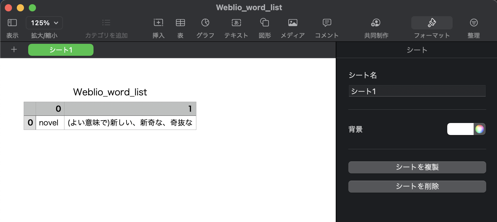

# bookmark-word-list

Chromeのブックマークのフォルダ内にあるWeblioのサイトから単語名とその意味を取得する

コードの大半は[こちら](https://harigami.net/cd?hsh=c4a5b7ed-8821-4d0d-a60d-e93fa69a9d65#L17)を利用した．

## how to use

`bookmark.py`の`folderLocationNumber`の値を，取得したい英単語のフォルダの番号へ入れ替える．

例えば，ブックマーク内のフォルダで，英単語のフォルダを先頭に設置しているなら以下のように`0`と書く．

```Python
folderLocationNumber = 0
bookmarks = bookmark_data['roots']['bookmark_bar']['children'][folderLocationNumber]['children']
```

その後，以下を実行する

```bash
poetry install
poetry run python solve.py
```
実行するとcsv形式のファイルが出力される．以下は[novel](https://ejje.weblio.jp/content/novel)の場合

```
,0,1
0,novel ,(よい意味で)新しい、新奇な、奇抜な
```

Numbersでcsvファイルを開いた場合


